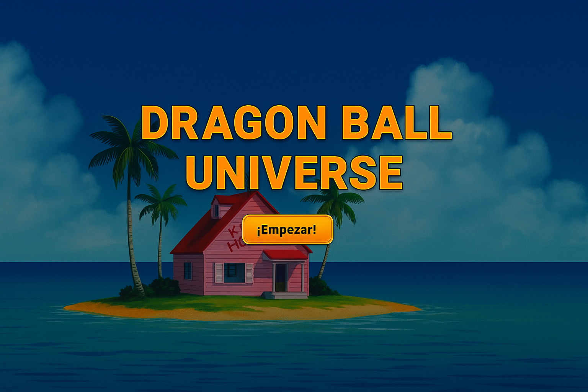

# 🌌 Dragon Ball Universe App

Una aplicación web interactiva y visualmente atractiva que te permite explorar personajes y planetas del universo Dragon Ball. Proyecto construido con HTML, CSS y JavaScript puro consumiendo una API pública.

---

## 🎯 Funcionalidades

- 🔍 **Búsqueda** en tiempo real de personajes por nombre.
- 🧑‍🚀 **Listado de personajes** con su raza, género y planeta de origen.
- 🌍 **Listado de planetas** con su cantidad de habitantes conocidos.
- 🎵 **Música de fondo** con control de reproducción.
- 🎬 **Pantalla de introducción animada** con botón de inicio.
- 📱 **Diseño responsive** y moderno.

---

## 📦 Estructura del Proyecto

dragonball-universe/
│
├── index.html // HTML principal
├── style.css // Estilos visuales
├── main.js // Lógica y manejo del DOM
├── assets/
│ ├── images/ // Imagen del fondo animado
│ │ └── descarga.gif
│ ├── audio/
│ │ └── Dragon Ball Z - Opening.mp3
└── README.md // Documentación

---

## 🔗 API Utilizada

- **Personajes:** https://dragonball-api.com/api/characters
- **Planetas:** https://dragonball-api.com/api/planets

---

## 🛠️ Tecnologías

- HTML5
- CSS3
- JavaScript 

---

## 📌 Autor

**Nicolás Riaño**  
Full Stack Developer  
GitHub: [@tuusuario](https://github.com/Nik1304)  
Instagram: [@tuInstagram](https://instagram.com/Nikolasdrm)

---

## 📃 Licencia

Este proyecto se distribuye bajo la licencia Nik. libre de usar y modificar.

